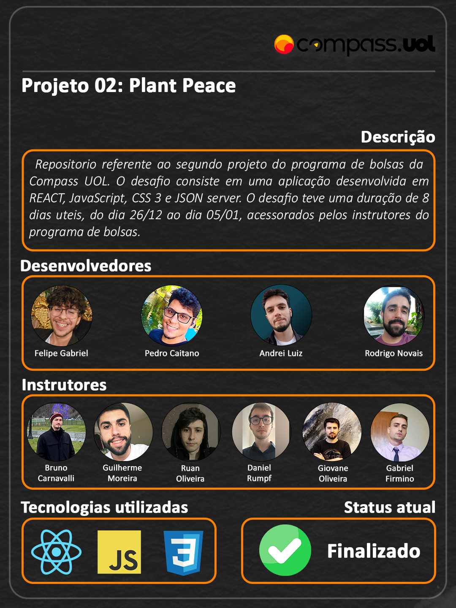

# Instalação

Navegue para o frontend e execute

```
npm install
```

# Execução do sistema
Execute dois terminais, para executar o frontend e backend.

1. Em um terminal, navegue ate a pasta do frontend e use o comando

```
npm run dev
```

2. No segundo terminal, navegue ate a pasta do backend e use o comando. O backend do json-server será executado na porta 3000.

```
json-server --watch db.json
```

# Rotas da aplicação

| Path            | Rota        |
| --------------- | ----------- |
| home            | /           |
| register        | /register   |
| products        | /products   |
| product details | /product/10 |
| about us        | /about-us   |
| sign-up         | /sign-up    |

# HTTP implementados

- GET
- POST
- DELETE

# Deploy

Deploy realizado na plataforma [Vercel](https://vercel.com/) para fins de demonstração do projeto. O sistema no deploy não possui banco integrado, devido a necessitar de ajustes no codigo fonte. Então, bugs ao recarregar a página são esperados.